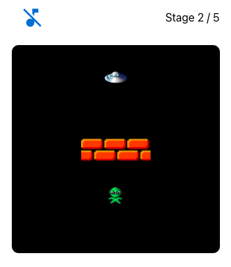

# ALIEN GO HOME

### `clone`

```
git clone https://github.com/codetyphon/alien-go-home
```

### `install`
```
cd alien-go-home
yarn install
```

### `start`

```
yarn start
```

Runs the app in the development mode.\
Open [http://localhost:3000](http://localhost:3000) to view it in the browser.

The page will reload if you make edits.\
You will also see any lint errors in the console.

### demo




## refs

https://hashnode.blainegarrett.com/html-5-canvas-react-refs-and-typescript-ckf4jju8r00eypos1gyisenyf

https://www.kindacode.com/article/react-typescript-handling-keyboard-events/